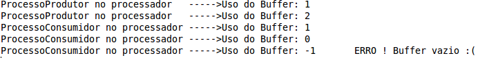
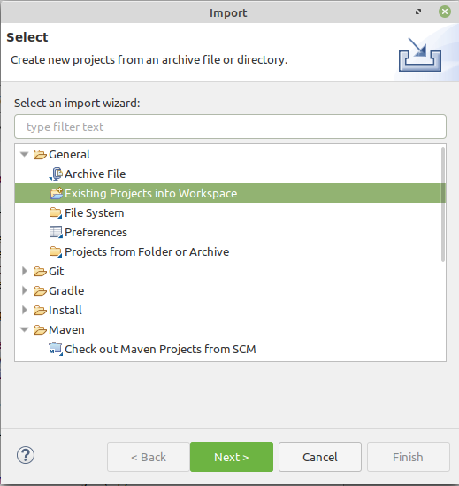
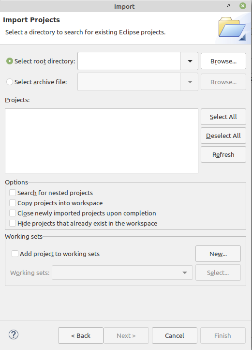

> **Project status:** complete :heavy_check_mark:  
> **Author:** Juliana Marino Balera :busts_in_silhouette:  
> **Year:** 2020 :date:  
> **Language:** Java :coffee:

# Exemplo de Processos Cooperativos 

Esse repositório guarda um exemplo de implementação do problema produtor-consumidor utilizado para ilustrar o conceito de processos cooperativos, referente a uma aula ministrada no contexto da disciplina de Sistemas Operacionais (SOPA2-IFSP-CJO). 

Foi utilizado a IDE eclipse (https://www.eclipse.org/downloads/). 

# Problema Produtor-Consumidor 

O problema produtor-consumidor ilustra a necessidade de haver comunicação entre determinados processos. Neste exemplo, existe a classe *Buffer.java* que implementa um buffer de tamanho limitado, a classe *ProcessoProdutor.java* que irá adicionar elementos nesse buffer, e a classe *ProcessoConsumidor.java* que irá retirar elementos desse mesmo buffer. A classe principal(*Processador.java*) representa o processador e a classe *Escalonador.java* representa um escalonador que escolhe os processos que irão utilizar a CPU de maneira aleatória.         

A figura a seguir mostra a saída da execução desse programa. Observe que um erro é exibido na tela quando o processo consumidor tenta consumir algo quado o buffer está vazio. 

## Como importar um projeto no eclipse :interrobang:

Para utilizar esse projeto em seu computador, basta baixa-lo e incluí-lo na pasta do workspace do eclipse. Após isso, abra a IDE, na aba "File", clique em "Importe...". Nesse momento, uma nova janela irá se abrir, como na figura a seguir:

Clique no ícone "General", e em seguida em "Existing Projects into Workspace". Dessa forma, uma nova janela irá abrir, como a seguir:

Selecione a opção "Select root directory" e clique em "Browse...". Nesse momento você deverá indicar o caminho da onde o seu projeto está (no caso da nossa disciplina, você irá indicar onde a pasta "dw2" está dentro do workspace do eclipse). Por fim, clique em "Finish". E pronto ! seu projeto foi importado no eclipse.  

